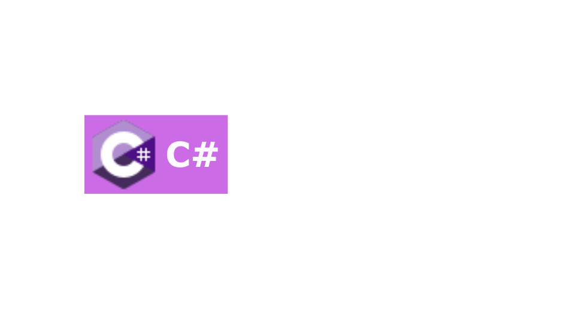

    
    

    

    <h2 style="border-bottom: 1px solid #21262d; color: #c9d1d9;"> 🛠️ Tech Stacks </h2>   
    
 
          
          
          
          
           
          
          
          
          
          
          

    

    

    <h2 style="border-bottom: 1px solid #21262d; color: #c9d1d9;"> 🧑‍💻 Contact me </h2>   
    
 
         
          

    

